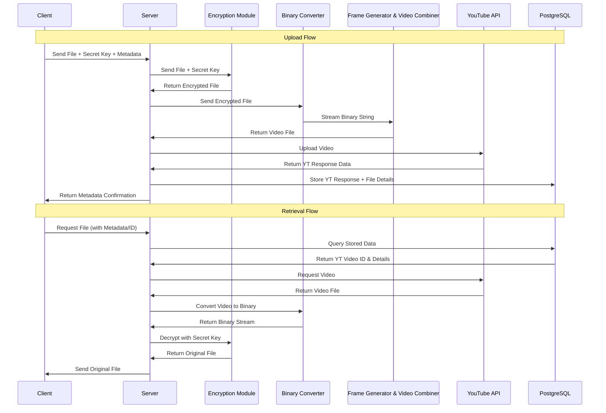

# just_store_anything
Java version of DvorakDwarf's  Infinite-Storage-Glitch with frontned

> [!NOTE]  
> If your uploaded file is too small ( < 10 MB ) then youtube might discard that video due to video length is less then 1s.

## Core Flow

## What implemented

### Frontend
- [x] YouTube access
- [x] Main page (file upload, other data)
- [x] Backend connectivity
- [x] retriever page

### Backend
- [ ] Encryption module
- [x] file to binary string
- [x] BS to image
- [x] images  to video
- [x] user oauth from Google for YouTube
- [x] YouTube upload
- [x] Database config and storing
- [x] retriever file base on metadata

- [ ] Clean code
- [ ] Better Examples
- [ ] All edge cases 
- [ ] Security
- [ ] Optimization (Threads)
- [ ] Improved UI